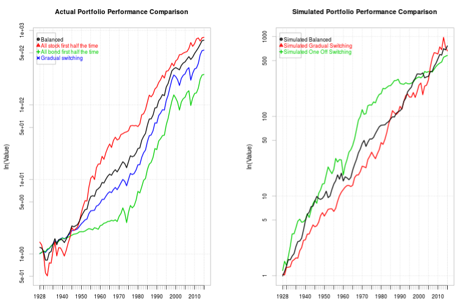
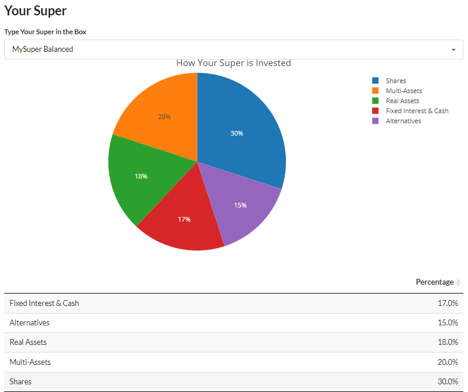

### Hi there :wave:, welcome to my Github garden

  

-   :moneybag: I love everything related to investment
-   :telescope: I’m currently building a cool startup called [Owner Super](https://www.ownersuper.com) which aims to democratise super investment.
-   :seedling: I’m currently learning product management and REACT
-   :book: I'm currently reading [Zero to One](https://www.amazon.com/Zero-One-Notes-Startups-Future/dp/0804139296)

:school: **Publications**

    
    
    

:memo: **Blog & Projects**

    
        
     
     

:books: **2022 Book List**

-   Completed - [The Private Equity Playbook](https://www.amazon.com/Private-Equity-Playbook-Managements-Working-ebook/dp/B07NFXRL3K/)
-   Completed - [Real Life MBA](https://www.amazon.com/Real-Life-MBA-Winning-Building-Growing/dp/0062362801)
-   Completed - [How to Get Startup Ideas](http://www.paulgraham.com/startupideas.html)
-   Completed - [The Lean Startup](https://www.amazon.com/Lean-Startup-Entrepreneurs-Continuous-Innovation/dp/0307887898)
-   Completed - [The Mom Test](https://www.amazon.com/The-Mom-Test-Rob-Fitzpatrick-audiobook/dp/B07RJZKZ7F) 
-   Completed - [Zero to One](https://www.amazon.com/Zero-One-Notes-Startups-Future/dp/0804139296)
-   WIP - [Working in Public: The Making and Maintenance of Open Source Software](https://www.amazon.com/Working-Public-Making-Maintenance-Software/dp/0578675862)
-   [DeFi and the Future of Finance](https://www.amazon.com/gp/product/B09DJV2QLC/)
-   [The Start-up of You](https://www.amazon.com/Start-up-You-Future-Yourself-Transform-ebook/dp/B00755MHV8)
-   [The Voltage Effect: How to Make Good Ideas Great and Great Ideas Scale](https://www.amazon.com/Voltage-Effect-Ideas-Great-Scale/dp/0593239482)
-   [So Good They Can't Ignore You](https://www.amazon.com/Good-They-Cant-Ignore-You-ebook/dp/B01KFR64LQ/)
-   [Atomic Habits](https://www.amazon.com/Atomic-Habits-Proven-Build-Break-ebook/dp/B07D23CFGR)
-   [Blitzscaling](https://www.amazon.com/Blitzscaling-Lightning-Fast-Building-Massively-Companies-ebook/dp/B07BBR9KCY/)
-   [Angel](https://www.amazon.com/Angel-Invest-Technology-Startups-Timeless-Investor/dp/0062560700)
-   [Blockchain Bubble or Revolution](https://www.amazon.com/Blockchain-Bubble-Revolution-Present-Cryptocurrencies-ebook/dp/B07T13GP1Q)
-   [Venture Deals](https://www.amazon.com/dp/B07YL8NHLH)
-   [Masters of Scale](https://www.amazon.com/Masters-Scale-Surprising-successful-entrepreneurs-ebook/dp/B08PK2HR6H/)
-   [How I built This](https://www.amazon.com/How-Built-This-Unexpected-Entrepreneurs-ebook/dp/B086ML44T1/)
-   [The Hard Thing About Hard Things](https://www.amazon.com/Hard-Thing-About-Hard-Things-audiobook/dp/B00I0A6HUO)
-   [Asset Allocation](https://www.amazon.com/gp/product/B09BBW5MSK)
-   [The Allocator's Edge](https://www.amazon.com/Allocators-Edge-alternative-investments-diversification-ebook/dp/B097RL8W37)
-   [Cryptoassets](https://www.amazon.com/Cryptoassets-Innovative-Investors-Bitcoin-Beyond-ebook/dp/B0743MPV9R)
-   [Investing Amid Low Expected Returns](https://www.amazon.com/Investing-Amid-Low-Expected-Returns/dp/1119860199)
-   [In Pursuit of the Perfect Portfolio](https://www.amazon.com/gp/product/B08WYR662K)
-   [The Exit Strategy Playbook](https://www.amazon.com/Exit-Strategy-Playbook-Definitive-Selling-Business-ebook/dp/B09D37DS6T)
-   [A Random Walk Down Wall Street](https://www.amazon.com/Random-Walk-Down-Wall-Street/dp/0393358380)
-   [A Non-Random Walk Down Wall Street](https://www.amazon.com/Non-Random-Walk-Down-Wall-Street/dp/0691092567)
-   [Principles for Dealing with the Changing World Order](https://www.amazon.com/dp/1982160276)
-   [Narrative Economics](https://www.amazon.com/gp/product/B087YYKL79)
-   [Big Debt Crises](https://www.amazon.com/dp/057856565X)
-   [The Misbehavior of Markets: A Fractal View of Financial Turbulence](https://www.amazon.com/dp/0465043577)
-   [Machine Learning for Asset Managers](https://www.amazon.com/Machine-Learning-Managers-Elements-Quantitative/dp/1108792898/)
-   [The Greatest Trade Ever](https://www.amazon.com/dp/0385529945)
